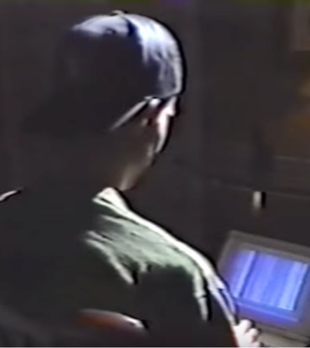

# 📰 1994 UFO Magazine

The following two articles were written by T. Scott Crain in response to an [October 27, 1992 _Dateline NBC_ television segment](https://www.youtube.com/watch?v=N0QflNaPi7A). I sourced copies of the magazines and transcribed the articles, adding relevant images.

<figure><figcaption>
UFO Magazine Vol. 9 No. 3
</figcaption></figure>

#### **1994** UFO Magazine, Volume 9, Number 3, Page 18:

## **UPDATE: **_**HACKER'S UFO FILES ON 'DATELINE'**_

&#x20;    In _UFO_ (Vol. 9, No. 2) I reviewed a news segment about computer hackers that appeared on _Dateline NBC_ on October 27, 1992. During an interview with one of the hackers seen in silhouette during the program, screens were displayed that read:

&#x20;    “WRIGHT PATTERSON AFB/Catalogued UFO parts list, an underground facility of Foreign...” and “KIRTLAND AFB/OFFICE OF SPECIAL INVESTIGATIONS, SANDIA/NSA INTERCEPT EQUIPMENT DIVISION/KEY WORDS/NAMES/Sandia Labs, Project Beta (1979-83-?), Paul Bennewitz.”

<figure><figcaption>
"Quentin" on Dateline NBC.
</figcaption></figure>

&#x20;    When I wrote the program back in November of '92, I got no response. However, after _UFO_ published my article, I wrote them again on March 4 of this year, and included a copy of the article.

&#x20;    On March 16, I received a call from Susan Adams, producer of that particular segment. She expressed dismay about the tone of the article, and any implication that the UFO screens were a production gimmick or trick of some sort.

&#x20;    Adams expressed surprise at the phenomenal response that NBC received regarding the approximately five seconds of footage showing computer screens with UFO data. Calls came in from as far away as London, she said, from viewers seeking further details about the screens and the hacker.

&#x20;    The segment was about computer hackers, not UFOs. The hacker interviewed, who wishes to remain anonymous, apparently had a lot of material, much of it delving into all sorts of classified data from government computers. “Dateline NBC” asked to see the most interesting stuff he had, and they narrowed it down to three subjects. “We chose to use the UFO data screens because we thought it was interesting material,” she said. “There was no effort by NBC to conceal information that may have followed on the screens.”

<figure><figcaption>
"Quentin" in silhouette.
</figcaption></figure>

&#x20;    Adams could not emphasize enough that NBC lawyers went over this segment with a fine-tooth comb, and as far as their crew is concerned, the material was legitimate. She explained that the hackers are committing a felony, and there’s no way their identities can be revealed. The hacker is aware of the interest his apparent UFO data has provoked, but does not wish to respond.

&#x20;         —_T. Scott Crain_

<figure><figcaption>
UFO Magazine Vol. 9 No. 2
</figcaption></figure>

#### 1994 UFO Magazine, Volume 9, Number 2, Page 14:

_How should we respond to a televised news report that contains tantalizing tidbits of reportedly classified military information? Was it real? Just a production gimmick? Or… planted disinformation?_

&#x20;    The program _“Dateline NBC”_ broadcast on Oct. 27, 1992 contained a segment on computer hackers. As one of the hackers interviewed on camera bragged about his ability to break into government and military computer systems, the TV screen briefly flashed a computer screen that contained words allegedly originating from the files of Project Bluebook. Viewers read this first snippet on the monitor: “WRIGHT PATTERSON AFB/Catalogued UFO parts list, an underground facility of Foreign...”

&#x20;    Unfortunately, the cameraman did not scroll down the computer screen to show the TV viewer what those parts were. A second screen listed the following: “KIRTLAND AFB/OFFICE OF SPECIAL INVESTIGATIONS, SANDIA/NSA INTERCEPT EQUIPMENT DIVISION/KEY WORDS/NAMES/Sandia Labs, Project Beta (1979-83-?), Paul Bennewitz.”

<figure><figcaption>
The screens in question.
</figcaption></figure>

&#x20;    If the first screen was authentic, then the data would seem to confirm many of the rumors that Wright-Patterson Air Force Base has a storage facility of UFO parts—and it’s underground.

&#x20;    The second screen listing a National Security Agency Intercept Equipment Division is interesting in light of the fact that Howard Burgess (a former Sandia scientist) and Paul Bennewitz (a scientist who headed Thunder Scientific Laboratories in Albuquerque) claimed they had monitored and recorded electromagnetic signals from a UFO that apparently flew over and/or made a soft landing at Kirtland Air Force Base.

&#x20;    The Air Force claims the signals were coming from an experiment they were conducting. Although initially interested in Bennewitz’ recordings and the alleged UFOs he had filmed, they ultimately wanted Bennewitz to discontinue his monitoring of activities happening near the base. According to scientist Jacques Vallée, when he refused, the Air Force launched a disinformation campaign to discredit him and his research. But that’s another story.

&#x20;    Are the screens to be believed? I wrote to Dateline NBC on Nov. 17, 1992, requesting more information and asking if they would forward my letter to the computer hacker who came up with those screens. To date, I have had no response from NBC or the hacker.

&#x20;    It is obviously hard to believe the Department of Defense or the Air Force would be so carefree as to have classified UFO data sitting in an easily accessed Air Force computer. The screens could be real, or they could be a trick either constructed by the hacker or planted by the Air Force. If nothing else, it’s another curious item spun off one of ufology’s more sordid cases.

&#x20;         —_T. Scott Crain_

