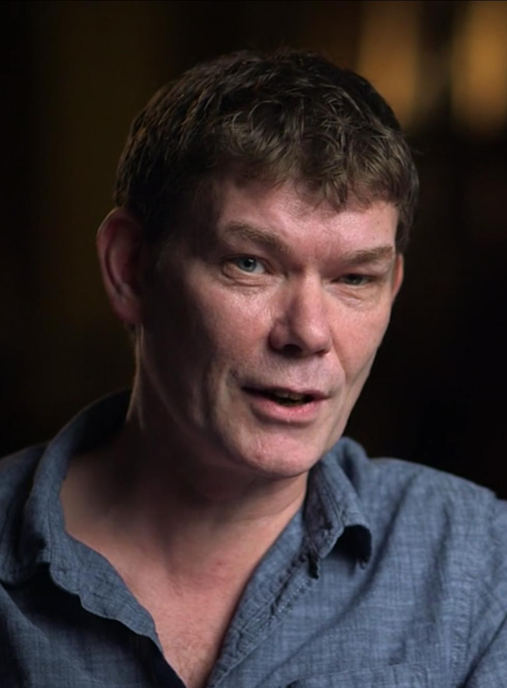
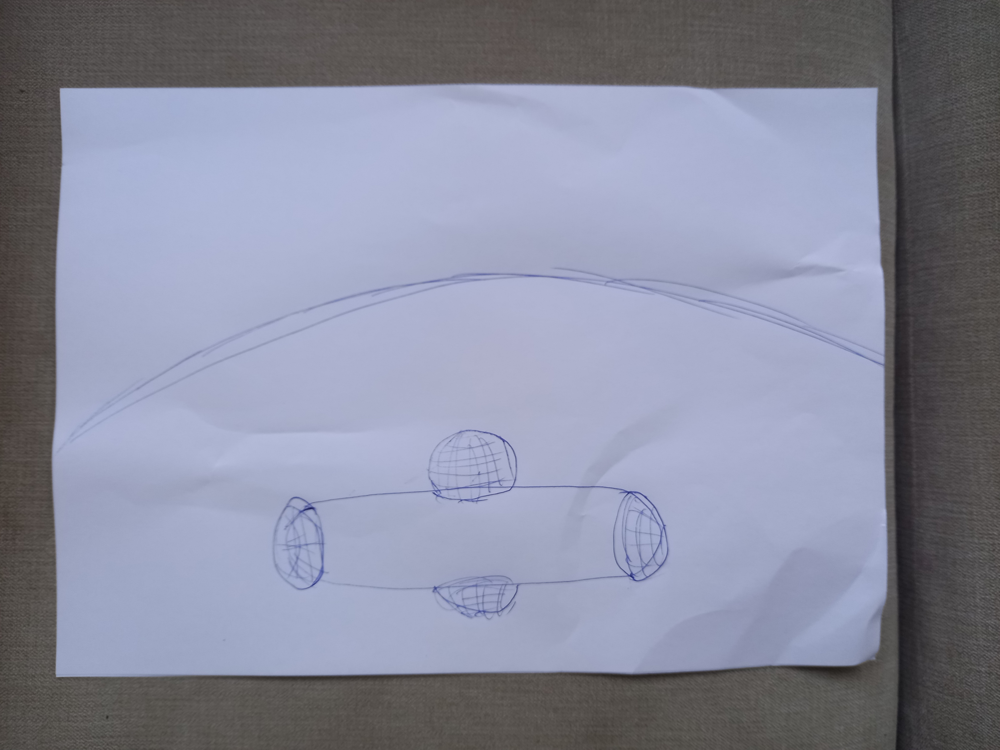
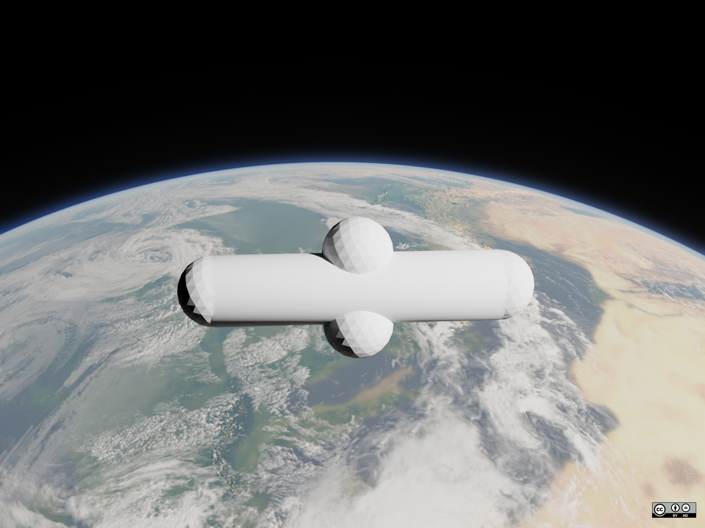
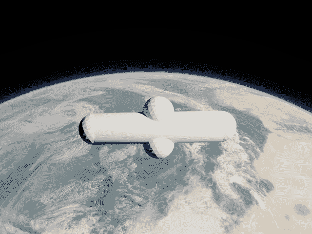

# 👨‍💻 McKinnon Overview



## **Most Well-Known: Gary "SOLO" McKinnon**

> _"The biggest military computer hack of all time."_ - US prosecuting attorney Paul McNulty

**2001-2002** [Gary "SOLO" McKinnon](https://en.wikipedia.org/wiki/Gary_McKinnon), the most well-known UFO hacker, breaks into US Army, US Navy, US Air Force, Department of Defense, and NASA computers by targeting systems with administrator passwords of "Administrator," "password," or blank. Gary accomplishes this using a Perl program to mass scan a /16 IP space and probe the NetBIOS protocol on port 139. He uses a 56K dial-up modem. On some systems, he installs RemotelyAnywhere for remote desktop. He uses Landsearch software to search through all files on all computers across a domain. On a Navy system, he sees spreadsheet tabs with titles such as "non-terrestrial officers" and "fleet-to-fleet transfers", with names of ships not known to be in the US Navy. Also, following Dr. Steven Greer's [Disclosure Project](https://www.youtube.com/watch?v=4DrcG7VGgQU) and specifically the testimony of [Donna Hare](https://www.youtube.com/watch?v=tEBLmWhx1K0), he targets Building 8 at NASA Johnson Space Center where UFOs are reportedly being airbrushed out of satellite photography before the photos are released to the public. He makes it onto a system and sees a 'raw' photo of a smooth [cylindrical craft with domes](https://imgur.com/a/FOwKTyy) that has no seams or rivets. However, he miscalculates the time zones and is disconnected by a local computer user before he can take a screenshot. Months later, he is arrested by the UK's National Hi-Tech Crimes Unit (who seized his computer) and he is put under an extradition order from the US. It will be a 10-year legal battle before his extradition is finally blocked by the UK over human rights and UK charges are eventually dropped. Gary still faces [US charges](https://web.archive.org/web/20060516102803/http://cryptome.org/ips-bared.htm).

* **2005** Interview in _The Guardian_ newspaper: [article](https://www.theguardian.com/theguardian/2005/jul/09/weekend7.weekend2) &#x20;
* **2005** Interview with _BBC News World Service_: [audio](https://www.bbc.co.uk/sounds/play/p03js2tq) &#x20;
* **2006** interview with Gary for _BBC Click Online_: [YouTube video](https://www.youtube.com/watch?v=8ZPqFVM6j6A) &#x20;
* **2006** interview by _Project Camelot_: [YouTube video](https://www.youtube.com/watch?v=t8MnfampJKU), [higher resolution video](https://odysee.com/project-camelot-gary-mckinnon-re-release:4d2a29deb3f304678557b927cad80fc5d63f5f52) &#x20;
* **2006** Interview for _WIRED Magazine_: [article](https://www.wired.com/2006/06/ufo-hacker-tells-what-he-found/) &#x20;
* **2006** Interview for _.net Magazine_: [article](https://medium.com/the-lindberg-interviews/interview-with-ufo-hacker-gary-mckinnon-5aa5d366828b)
* **2007** "SOLO" interviewed on _Hacker's Voice Radio_ podcast:[ mp3 audio](http://www.hackervoice.co.uk/show/archive/2007/hackervoiceradio19mar2007.MP3) &#x20;
* **2007** talk on Gary at UFO Crash Con by Matthew Williams: [YouTube video](https://www.youtube.com/watch?v=Gf5uek-vSQE) &#x20;
  * Proceedings from this conference include an interview with Gary [here](2007-ufo-crash-con.md). &#x20;
* **2008** Gary McKinnon Intervew Footage by ITN: [Getty Images](https://www.gettyimages.com/detail/video/gary-mckinnon-interview-sot-on-low-levels-of-security-on-news-footage/665225922) &#x20;
* **2009** "Gary McKinnon: Britain's Hacking Hero?": [article](https://www.alphr.com/features/252972/gary-mckinnon-britains-hacking-hero) &#x20;
* **2011** "The Autistic Hacker", profile in IEEE Spectrum: [article](https://spectrum.ieee.org/the-autistic-hacker) &#x20;
* **2015** Interview by Richard D. Hall: [YouTube video](https://www.youtube.com/watch?v=SsfrmTXuw1Q) &#x20;
* **2017** [Gary](https://web.archive.org/web/20220816040612/https://smallseo.co.uk/ill-be-speaking-at-the-mufon-symposium-2017/) spoke via video link at the MUFON Symposiu&#x6D;**:** &#x20;
  * I have uploaded the full talk with audience questions [here](https://youtu.be/t43NJjpXGE8). Just the talk is on [Gary's YouTube](https://youtu.be/LTemN5XTdec).
  * The symposium proceedings include a transcript of Gary's speech, which I have archived [here](2017-mufon-symposium.md).
* **2018** [Gary](https://web.archive.org/web/20220816034327/https://smallseo.co.uk/ill-be-on-the-next-series-of-ancient-aliens/) is featured on _Ancient Aliens_: [YouTube video](https://www.youtube.com/watch?v=20rWFDfh68Y)
* **2019** _UFO Chronicles_ podcast: [web player](https://ufochroniclespodcast.com/ep2-gary-mckinnon/), [Spotify](https://open.spotify.com/episode/1xTupuxv2S5G40uVXz1cQD?si=80d9994ffec94d60), [mp3 audio](https://api.spreaker.com/download/episode/52831240/ep_2_gary_mckinnon.mp3?dl=true) &#x20;
* **2019** Interview by Richard Dolan: [YouTube video](https://www.youtube.com/watch?v=y6Is7809XFU) &#x20;
* **2020** Interview by Richard Medhurst: [article](https://www.richardmedhurst.com/gary-mckinnon-interview/) &#x20;
* **2022** Gary McKinnon's Reddit AMA on /r/UFOs: [Reddit thread](https://old.reddit.com/r/UFOs/comments/t0imdw/hi_im_gary_mckinnon_i_was_in_the_news_for_a/) &#x20;
* **2022** interview by Tim Ventura: [YouTube video](https://www.youtube.com/watch?v=_SOTGFj7BwI)
* **2023** interview by 'M' Seeker of Truth: [YouTube video](https://www.youtube.com/watch?v=BT_cX6mpAms)
* **2023** interview by Chris Thrall: [YouTube video](https://www.youtube.com/watch?v=spRfMxOB9zM)
* **2024** Gary McKinnon is featured in James Fox's documentary film: [The Program](https://geni.us/TheProgram)
* **2025** Gary McKinnon rejoins Twitter/X as [@realGMcKinnon](https://x.com/realGMcKinnon/)

### Corroborating Technical Evidence

First, Gary says that he used IPindex.net for reconnaissance. Using the [Internet Archive of that site](https://web.archive.org/web/20000510074952/http://www.ipindex.net/index.html), and comparing it with [the specific IPs from his indictment](https://cryptome.org/ips-bared.htm), we can see that the IP ranges in Texas correspond to NASA Johnson Space Center. &#x20;

```
139.169.0.0	NASA/Johnson Space Center, TX (NET-JIN)
```

Next, Gary says he used RemotelyAnywhere to remotely control the NASA JSC desktop. Looking at the 2002 [manual for RemotelyAnywhere](https://manualzz.com/doc/32532703/remotelyanywhere-documentation), remote installation is documented: &#x20;

```
Install <–computer COMPUTER> <–path PATH> [-port PORT] [-minimal] [-license FILENAME]
```

Last, I found this program in an old CD-ROM's contents: [About Proxynator screenshot](https://imgur.com/a/NbN7V)  \
I used these same hacking techniques at around the same time. As seen, the idea is attributed to "SOLO", capitalized the same as Gary's handle. &#x20;

#### Overlap with IP Addresses from the [Quentin Text File](http://cd.textfiles.com/secretsubjects/UNDERGRD/VOL_5/CUD513D.TXT)

Gary told me that he _"remembers the Quentin docs and other stuff"_ and that the IP addresses overlap with what he found. I looked into this, and found the following:

```
Army Fort Irwin, Barstow, CA
	McKinnon Indictment: 134.66.12.64
	Project Green Cheese: Network 134.66.x.x
NASA Ames, Moffett Field Naval Base, CA
	McKinnon Indictment: 192.150.x.x (192.150.38.45, 192.150.38.14, 192.150.38.51, 192.150.38.125)
	Project Green Cheese: Network 192.52.195.1
Pentagon, Arlington, VA
	McKinnon Indictment: 141.116.x.x (141.116.58.63, 141.116.204.150, 141.116.230.88)
	Project Green Cheese: Network 141.116.0.1, Random Suspected Nets: 141.x.x.x
```

### Dispelling Rumors and Myths

According to Gary, there is _"_[_No such programme!_](https://imgur.com/a/gary-mckinnon-says-no-solar-warden-uDvih5G)_"_ as Solar Warden. He has consistently said that he does not remember the names of the ships in the "fleet-to-fleet transfers" document, and when asked specifically about the names "USSS Hillenkoetter" and "USSS Curtis LeMay" [during the Q\&A](https://youtu.be/HdSSHTYRhuk?t=2450) after his 2017 MUFON Symposium talk, he reiterated that he does not remember those names. The earliest reference I can find to these is a [2010 article](https://openminds.tv/what-did-ufo-hacker-really-find/) by Alejandro Rojas, who attributes them to rumors.

### Additional Links for Further Information on Gary

* **2012** [Gary was unlucky](https://www.independent.co.uk/voices/comment/gary-was-unlucky-he-s-not-even-a-good-hacker-8215802.html) by Peter Warren (how Gary was caught) &#x20;
* **2012** BBC [Profile: Gary McKinnon](https://www.bbc.com/news/uk-19946902) (why Gary's extradition was blocked) &#x20;
* **2014** [From Kuji to Solo](https://vocal.media/futurism/from-kuji-to-solo) by Ryan Sprague (covers both Mathew Bevan and Gary McKinnon) &#x20;
* **2016** [UFO Hacker Gary McKinnon Story](https://web.archive.org/web/20220128033810/http://fourthkind.com/ufo-hacker-gary-mckinnon-story/) by Joel Hasse (/u/EarthmanJoel's fantastic article) &#x20;
* **2016** [Hackers Expose Secret Space Missions and Government UFO Research](https://www.gaia.com/article/hackers-expose-secret-space-missions-and-government-ufo-research) by Gaia Staff (factual errors) &#x20;
* **2020** [UFO Hackers Pay the Price](https://medium.com/on-the-trail-of-the-saucers/from-kuji-to-solo-how-one-mans-curiosity-paved-the-way-for-a-new-generation-of-ufo-hackers-a94344452083) by Ryan Sprague (almost entirely a repost of his 2014 article) &#x20;
* **2024** [The Man Who Hacked the U.S. Government](https://www.youtube.com/watch?v=ND0zQX1rGdg) by Newsthink (YouTube video) &#x20;

Reportedy, a TV movie based on Gary McKinnon is in the works. ([Deadline](https://deadline.com/2023/11/bbc-gary-mckinnon-computer-hacker-drama-1235643829/)) &#x20;

<figure><figcaption><p>Gary McKinnon's drawing of what he witnessed on a NASA computer in Johnson Space Center building 8.</p></figcaption></figure>

<figure><figcaption><p>I worked with Gary McKinnon and an artist to render this computer-generated image of what Gary saw on a NASA computer.</p></figcaption></figure>

<figure><figcaption><p>This image has 8 colors and is 640x480 resolution, as Gary had changed settings to speed up the connection.</p></figcaption></figure>
