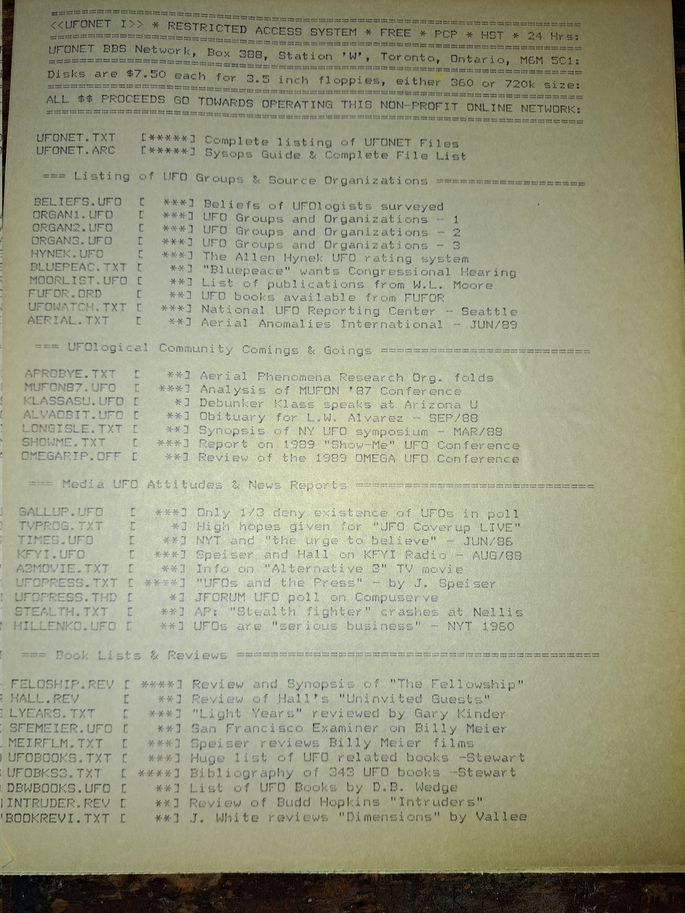

# 📺 Archives & BBSes

### **Historically Relevant: BBSes and Other Archives**

* _1976-1996_ UFO discussion takes place on BBSes (Bulletin Board Systems):\
  [TextFiles.com archive](http://textfiles.com/ufo/), [UFOBBS.com archive](https://github.com/thomhastings/ufobbs) (file [2850](http://textfiles.com/ufo/UFOBBS/2000/2850.ufo) is "Quentin" again) &#x20;
* _1982-1998_ [Archive kept by Charles McGrew](https://web.archive.org/web/20060909043351/http://paul.rutgers.edu/~mcgrew/ufo/) of Rutgers University
* _1986-1995_ [ParaNet-MICAP BBS UFO File Archives](https://web.archive.org/web/20080513234238/http://www.paranetinfo.com:80/ufofiles.html) (Multi-national Investigations Cooperative on Aerial Phenomena) &#x20;
* _1987-2001_ Additional zines and texts: [HackCanada archive via Internet Archive](https://web.archive.org/web/20181110090601/www.hackcanada.com/blackcrawl/ufo.html) &#x20;
* _1989-2014_ A search reveals a BBStro or two for Ufopaedia: [defacto2.net](https://defacto2.net/search/file) &#x20;
* _1994_ alt.alien.visitors Usenet newsgroup FAQ (7 parts): [UFOs-and-Aliens FAQ](http://www.faqs.org/faqs/ufos-and-aliens/) &#x20;
* _1995_  ["Project UFO" - 6 Amiga Disk Images](https://discmaster.textfiles.com/browse/9906) (plaintext diskmag, more to search on diskmaster)
* _1990's_ UFO BBS Files archive: [Sacred-Texts.com repository of UFO BBS Files](https://www.sacred-texts.com/ufo/ufobbs.htm)
* _1981+_ A trove of historical Usenet newsgroup postings can be found on [Google Groups](https://groups.google.com/forum/#!forumsearch/ufo) &#x20;
* _Unknown_ A massive and incredible archive found by a friend: [PreterHuman.net archive](http://cdn.preterhuman.net/texts/alien.ufo/) &#x20;
* Related TXT: The late John Lear's letters: [1987](http://www.wolfbane.com/articles/john.lear.letter.pdf), [1988](http://www.sacred-texts.com/ufo/coverup.htm) (See also [John Lear](https://web.archive.org/web/20190319121708/http://www.therealjohnlear.com/TheRealJohnLear.com/HOME.html)'s [Websites](http://thelivingmoon.com)) &#x20;

<figure><figcaption>
UFONET BBS printout from Grant Cameron's archives
</figcaption></figure>


BBS printout from Grant Cameron's archives



BBS printout from Grant Cameron's archives

