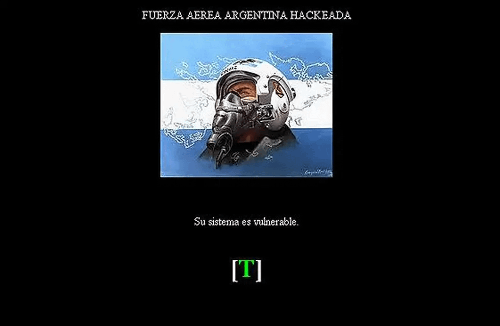

# 🇦🇷 Argentina Hacktivism

On January 20, 2011, the official website of the Argentine Air Force was hacked, condemning the cover-up by “government agents and foreign military” of the crash of an extraterrestrial spacecraft in 1985 in Mendoza.

<figure><figcaption>
What the defaced page of the Argentine Air Force looked like.
</figcaption></figure>

In 2011 the official website of the Argentine Air Force suffered an "unauthorized modification" denouncing the concealment, by this force, of the crash of a cigar-shaped craft in Mendoza on January 26, 1985.

The message left by the hacker(s) reads as follows:

> Did you know exactly what happened on January 26, 1985?
>
> Through an investigation I conducted, with people in the area and others...they said they saw SOMETHING at that time, both in the sky and in part of the area where "something fell", the place where it was cut off by government agents, without naming those "foreign military".
>
> Through the account of another person of great confidence, whose name I will not give, was sent to the area where, according to what he told me, he saw a ship in the shape of a cigar, and beings inside.
>
> The worst of all is that there is a video of this accident.
>
> Stop lying and hiding.
>
> We hope that this project in which you are working, to deal with UFO issues in Argentina, does not end up being like the rest, where you hide all kinds of information, and above all, you train disinformants?

The "project" mentioned was the Commission for the Study of Aerospace Phenomena (CEFAE) created on May 6, 2011, now the [Aerospace Identification Center.](https://web.archive.org/web/20230309231647/https://www.argentina.gob.ar/fuerzaaerea/centro-de-identificacion-aeroespacial)

The following is an excerpt from an article covering the website defacement:

> _"A hacker intervened the official website to claim information about a strange event that occurred in January 1985 in Mendoza. The site is now functioning normally._
>
> _The hacking of the page lasted only a few hours, but it was enough for the author's message to circulate on the web._
>
> _In the page he introduced a photo of a pilot, his signature and a text telling about the event of January 26, 1985 in Mendoza._
>
> _In his denunciation, he indicates that on that day a cigar-shaped object fell in the area of Papagayos and that a large number of national and foreign military personnel were present._
>
> _According to Los Andes newspaper, that same day an earthquake shook the area and the local inhabitants attributed it to the fall of the object."_

Here is a complete longer and more detailed article:

> _An individual accessed the official website of the Argentine air defense agency and provided information on an alleged 1985 event in Mendoza, which “government agents and foreign military” concealed._
>
> _A web hacker intervened today the official web page of the Argentine Air Force to claim the clarification of an alleged UFO crash in 1985, in Mendoza._
>
> _The site was headed by a title that read “Fuerza Aérea Argentina hackeada” (Argentine Air Force hacked) and below was the face of a pilot and a legend that warned “your system is vulnerable”, together with the corresponding complaint made by the hacker._
>
> _The text indicates that “through an investigation” carried out by the hacker, who claims to have gathered testimonies from witnesses and other sources, on January 26, 1985 “something crashed” near the town of Papagayos (Las Heras, Mendoza). According to the complaint, the area was surrounded by “government agents” and “foreign military”._
>
> _It also states that, according to the account of “another person of great trust”, in the place there was “a ship in the shape of a cigar, and beings inside”. And he adds, “The worst of all is that there is a video of this accident.” “Stop lying and hiding”, he claims._
>
> _Then, he reproduces an alleged statement of the National Gendarmerie Corporal Alfredo Ocampo, who had been taken urgently “to the area of Papagayos”, where he saw a “big hole of about 60 meters in diameter and white smoke coming out from inside (sic.)”._
>
> _There he was on duty for 12 hours and saw personnel with “suits similar to those of astronauts \[who] entered the hole by means of cranes”. He was then relieved and sent back 24 hours later, but the hole “had been plugged with metal plates.”_
>
> _According to the alleged statement, “seven days after having been on duty in the area, the affected personnel were advised to keep silent about anything we might have seen, then we were examined with geiger detectors (used to measure radiation) hidden among cardiographs and other devices, I suppose so as not to scare us, we were given a month's leave without notice and outside the schedule and two mandatory medical check-ups”._

Sources:

[Hackearon la web de la Fuerza Aérea para denunciar que ocultó la caída de un OVNI](https://web.archive.org/web/20230309231647/https://www.infobae.com/2011/01/21/557844-hackearon-la-web-la-fuerza-aerea-denunciar-que-oculto-la-caida-un-ovni/)

[Hackean sitio de la Fuerza Aérea para denunciar que ocultó "ovnis"](https://web.archive.org/web/20230309231647/https://www.lavoz.com.ar/noticias/politica/hackean-sitio-de-la-fuerza-aerea-para-denunciar-que-oculto-ovnis/)

[Hacker ataca página de la Fuerza Aérea argentina para denunciar ocultamiento de caída de ovni](https://web.archive.org/web/20230309231647/https://www.elmostrador.cl/noticias/mundo/2011/01/20/hacker-ataca-pagina-de-la-fuerza-aerea-argentina-para-denunciar-ocultamiento-de-caida-de-ovni/)

['Hackean' web de Fuerza Aérea argentina para acusarle de ocultar caída de ovni](https://web.archive.org/web/20230309231647/https://www.elespectador.com/actualidad/hackean-web-de-fuerza-aerea-argentina-para-acusarle-de-ocultar-caida-de-ovni-article-246193/)

["Hackean" web de Fuerza Aérea argentina para acusarle de ocultar caída ovni](https://web.archive.org/web/20230309231647/https://www.vanguardia.com/mundo/hackean-web-de-fuerza-aerea-argentina-para-acusarle-de-ocultar-caida-ovni-MCVL89394)

[Hackean Fuerza Aérea Argentina](https://web.archive.org/web/20230309231647/https://www.uypress.net/Actualidad/Hackean-Fuerza-Aerea-Argentina-uc12030)

[Reddit r/UFOs](https://reddit.com/r/UFOs/comments/1d7ntms/on\_january\_20\_2011\_the\_official\_website\_of\_the/)
