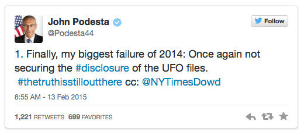
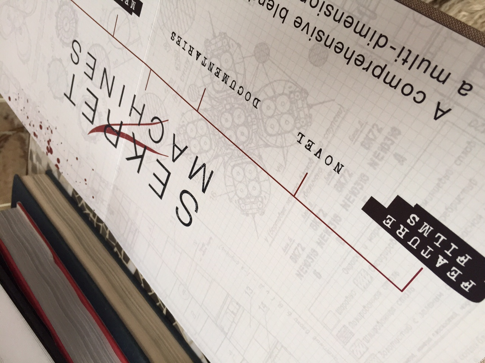
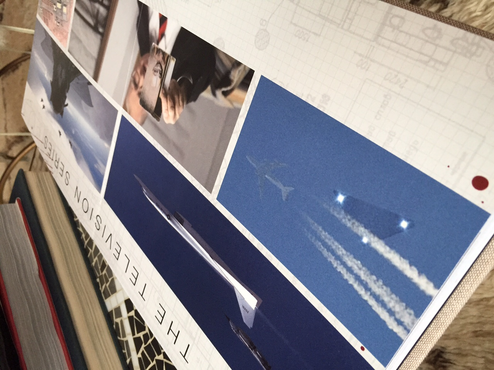
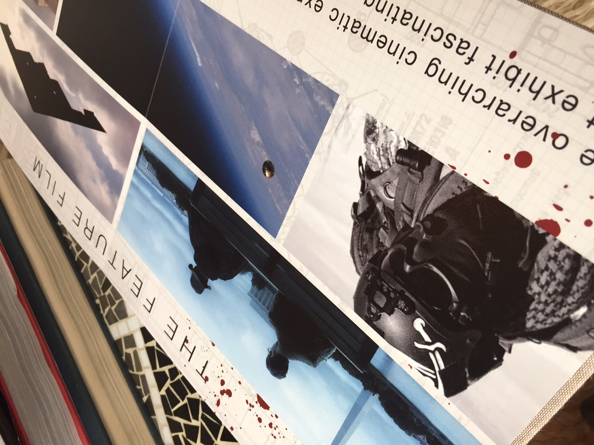

# ⏳ WikiLeaks

In March 2016 the US Democratic National Committee (DNC) was targeted by Russian hackers. Clinton Campaign Chair John Podesta's personal Gmail account was compromised via a spear-phishing attack. Those emails were posted on WikiLeaks in October of that year.

The hacking of the DNC has been linked to Russian Intelligence. Two groups of Russian hackers, commonly referred to as "Cozy Bear" (APT29) and "Fancy Bear" (APT28), were responsible for the breaches. These groups are associated wyth Russian intelligence agencies--the Federal Security Service (FSB) and the Main Intelligence Directorate (GRU).

## John Podesta

John Podesta was also the White House Chief of Staff under president Bill Clinton and counselor to Barack Obama. John Podesta is known to have an interest in UFOs, speaking at the Disclosure Project in 2001 and Tweeting about disclosure in 2015.


John Podesta speaks at the Disclosure Project at the National Press Club in 2001.


<figure><figcaption>
John Podesta's 2015 Tweet as he was leaving the Obama administration.
</figcaption></figure>

Podesta's leaked emails contain a few threads related to UFO disclosure, in particular interactions with the late astronaut Dr. Edgar Mitchell and Blink-182 frontman Tom DeLonge.

## Dr. Edgar Mitchell

In a series of emails spanning 2014–2015, Apollo 14 astronaut Dr. Edgar Mitchell persistently sought meetings with John Podesta to discuss extraterrestrial intelligence (ETI), space treaties, and peaceful space exploration, urging disclosure of government knowledge about ETI and emphasizing the need for collaboration with benevolent ETI to avoid potential conflict in space.


Peace in space treaty sent to John Podesta on behalf of the late astronaut Dr. Edgar Mitchell.


Before his death, emails sent on behalf of Dr. Edgar Mitchell were to set up a Skype meeting with Podesta regarding UFO disclosure, zero point energy technology, and peace in space.


Another attachment related to peace in space sent to John Podesta on behalf of Dr. Edgar Mitchell.


## Tom Delonge

In emails from 2015–2016, musician Tom DeLonge communicated with John Podesta to discuss his efforts to advance public understanding of UFO phenomena, sharing updates on his advisory team of military and scientific experts, highlighting the role of General Neil McCasland, and seeking Podesta's support for his disclosure-focused initiatives.

<figure><figcaption>
Sekret Machines promotial image
</figcaption></figure>

 

<figure><figcaption>
Promotional images sent by DeLonge
</figcaption></figure>

 

<figure><figcaption>
More promotional images sent to Podesta
</figcaption></figure>

Tom DeLonge set up a Google Hangout meeting with John Podesta, General Neil McCasland, and others. DeLonge discussed in emails with Podesta his advisors in the defense and intelligence communty, and laid out his multimedia UFO disclosure project, "Sekret Machines." DeLonge sent Podesta promotional images, a PDF copy of the first Sekret Machines book, and a trailer for a documentary film featuring clips of an interview with Podesta. Podesta replied directly to one of the emails that DeLonge sent him.


Teaser trailer for Tom Delonge's "Sekret Machines" documentary, featuring clips of an interview with Podesta.


## Bob Fish

Podesta also corresponded with former defense contractor and program manager Bob Fish. In March 2015, Bob Fish emailed John Podesta, suggesting that UFO researchers focus on analyzing hard scientific data, such as radar and thermal imaging, collected by U.S. government programs like the Air Force's Defense Support Program satellites, to better understand unidentified aerial phenomena. Podesta responded. Read more [here](https://www.ufojoe.net/bob-fish/).

## Sources

All of these emails can be read on [WikiLeaks](https://wikileaks.org/podesta-emails/), and can be found by searching, for example, "Edgar Mitchell," or "Tom Delonge." Internet Archive links to the most related emails can be found below.

### [Dr. Edgar Mitchell emails](https://wikileaks.org/podesta-emails/?q=edgar+mitchell\&mfrom=\&mto=\&title=\&notitle=\&date\_from=\&date\_to=\&nofrom=\&noto=\&count=50\&sort=1#searchresult), chronological order:

1.) 2014-01-14 09:29 [Dr Edgar Mitchell Request for Appointment](https://web.archive.org/web/20161107125855/https://wikileaks.org/podesta-emails/emailid/41591)\
2.) 2014-06-25 10:04 [Apollo Astronaut, Dr. Edgar Mitchell’s, Request for Meeting to discuss Disclosure](https://web.archive.org/web/20170528211827/https://wikileaks.org/podesta-emails/emailid/41124)\
3.) 2014-07-29 13:53 [Re: Apollo Astronaut, Dr. Edgar Mitchell’s, Request for Meeting to discuss Disclosure](https://web.archive.org/web/20161113221330/https://wikileaks.org/podesta-emails/emailid/15052)\
4.) 2014-08-02 11:50 [Exoconsciousness and Library of Congress Symposium: Request for conversation](https://web.archive.org/web/20201003130703/https://wikileaks.org/podesta-emails/emailid/58108)\
5.) 2014-10-01 09:35 [email for John Podesta (c/o Eryn Sepp) from Apollo 14 astronaut Edgar Mitchell requesting meeting](https://web.archive.org/web/20161103224748/https://wikileaks.org/podesta-emails/emailid/12127)\
6.) 2015-01-16 13:38 [email for John Podesta strategy (c/o Eryn) from Edgar Mitchell](https://web.archive.org/web/20190401102741/https://www.wikileaks.org/podesta-emails/emailid/58918)\
7.) 2015-01-18 19:34 [email for John Podesta (c/o Eryn) from Edgar Mitchel re meeting ASAP](https://web.archive.org/web/20161110043710/https://wikileaks.org/podesta-emails/emailid/1766)\
8.) 2015-01-21 23:48 [email for John Podesta (c/o Eryn) re Air Force disclosure](https://web.archive.org/web/20161115042338/https://wikileaks.org/podesta-emails/emailid/32937)\
9.) 2015-03-05 20:24 [email from Edgar for John Podesta (c/o Eryn): meeting request](https://web.archive.org/web/20161114014013/https://wikileaks.org/podesta-emails/emailid/32833)\
10.) 2015-04-07 10:20 [email for John Podesta (c/o Eryn) re Disclosure](https://web.archive.org/web/20161110062835/https://wikileaks.org/podesta-emails/emailid/35713)\
11.) 2015-04-15 23:48 [email for John Podesta ( c/o Eryn) re ETI](https://web.archive.org/web/20161103224534/https://wikileaks.org/podesta-emails/emailid/33722)\
12.) 2015-04-30 18:13 [email for John Podesta re talk with Edgar Mitchell cc: Eryn](https://web.archive.org/web/20161109175127/https://wikileaks.org/podesta-emails/emailid/27026)\
13.) 2015-05-19 23:36 [Eryn FW: email for John Podesta re talk with Edgar Mitchell cc: Eryn](https://web.archive.org/web/20161110001356/https://wikileaks.org/podesta-emails/emailid/33713)\
14.) 2015-06-11 10:31 [email for John Podesta (Eryn) from Edgar Mitchell re Skype](https://web.archive.org/web/20170208140435/https://wikileaks.org/podesta-emails/emailid/44097)\
15.) 2015-07-10 23:21 [FW: email for John Podesta (Eryn) from Edgar Mitchell re Skype](https://web.archive.org/web/20161110024438/https://wikileaks.org/podesta-emails/emailid/6983)\
16.) 2015-08-18 10:30 [email for John Podesta c/o Eryn re Space Treaty (attached)](https://web.archive.org/web/20161115102947/https://wikileaks.org/podesta-emails/emailid/1802)

### [Tom DeLonge emails](https://wikileaks.org/podesta-emails/?q=tom+delonge\&mfrom=\&mto=\&title=\&notitle=\&date\_from=\&date\_to=\&nofrom=\&noto=\&count=50\&sort=1#searchresult), chronological order:

1.) 2015-07-19 23:44 [Follow up note from Tom Delonge](https://web.archive.org/web/20200920212244/https://wikileaks.org/podesta-emails/emailid/49167)\
2.) 2015-07-25 19:33 [Note from Tom Delonge](https://web.archive.org/web/20201001064314/https://wikileaks.org/podesta-emails/emailid/21962)\
3.) 2015-08-01 20:57 [Fwd: Update](https://web.archive.org/web/20200926065407/https://wikileaks.org/podesta-emails/emailid/37930)\
4.) 2015-09-24 16:29 [Tom DeLonge here-](https://web.archive.org/web/20191007083215/https://wikileaks.org/podesta-emails/emailid/33739)\
5.) 2015-10-26 23:13 [Important things-](https://web.archive.org/web/20161011111627/https://wikileaks.org/podesta-emails/emailid/2125)\
6.) 2015-11-16 13:14 [Fwd: Important](https://web.archive.org/web/20161125014529/https://wikileaks.org/podesta-emails/emailid/4804)\
7.) 2016-01-24 23:45 [Re: Invitation: DeLonge/Podesta Meeting @ Mon Jan 25, 2016 10:30am - 11:30am (neilmcc79@gmail.com)](https://web.archive.org/web/20161107133346/https://wikileaks.org/podesta-emails/emailid/5078)\
8.) 2016-01-25 03:27 [Materials for Mr. Podesta](https://web.archive.org/web/20170528144106/https://wikileaks.org/podesta-emails/emailid/54984)\
9.) 2016-01-25 16:04 [General McCasland](https://web.archive.org/web/20161011111535/https://wikileaks.org/podesta-emails/emailid/3099)\
10.) 2016-01-25 16:37 [By the way-](https://web.archive.org/web/20200920215359/https://wikileaks.org/podesta-emails/emailid/40204)\
11.) 2016-01-26 13:39 [Re: By the way-](https://web.archive.org/web/20210613083842/https://wikileaks.org/podesta-emails/emailid/38052)\
12.) 2016-02-09 15:47 [Fwd: Interesting news](https://web.archive.org/web/20170118072700/https://wikileaks.org/podesta-emails/emailid/33552)\
13.) 2016-02-13 14:14 [A good read...](https://web.archive.org/web/20161107072753/https://wikileaks.org/podesta-emails/emailid/43067)\
14.) 2016-02-14 12:07 [Re: A good read...](https://web.archive.org/web/20200920210546/https://wikileaks.org/podesta-emails/emailid/51537)\
15.) 2016-02-14 15:29 [Fwd: Podesta and UFOs](https://web.archive.org/web/20170119020506/https://wikileaks.org/podesta-emails/emailid/43772)\
16.) 2016-02-16 01:59 [Rolling Stone](https://web.archive.org/web/20190802164216/https://wikileaks.org/podesta-emails/emailid/14683)\
17.) 2016-02-22 00:06 [Advisors](https://web.archive.org/web/20161018140935/https://wikileaks.org/podesta-emails/emailid/15486)\
18.) 2016-02-23 17:03 [Updates](https://web.archive.org/web/20191007083237/https://wikileaks.org/podesta-emails/emailid/19062)\
19.) 2016-03-02 14:38 [Fwd: Podesta/UFO](https://web.archive.org/web/20161107131508/https://wikileaks.org/podesta-emails/emailid/11641)\
20.) 2016-03-12 19:44 [VICE News](https://web.archive.org/web/20201113123855/https://wikileaks.org/podesta-emails/emailid/57684)

### Bob Fish emails, chronological order:&#x20;

1.) 2015-03-05 21:11 [Leslie Kean book comment](https://web.archive.org/web/20211024234222/https://wikileaks.org/podesta-emails/emailid/47433)\
2.) 2015-03-05 21:38 [Re: Leslie Kean book comment](https://web.archive.org/web/20161107125332/https://wikileaks.org/podesta-emails/emailid/18724)\
3.) 2015-03-06 16:17 [Leslie Kean book - DSP program](https://web.archive.org/web/20190410043240/https://wikileaks.org/podesta-emails/emailid/54211)\
4.) 2015-03-07 18:28 [Re: Leslie Kean book - DSP program](https://web.archive.org/web/20161107072958/https://wikileaks.org/podesta-emails/emailid/36957)\
5.) 2015-03-06 18:10 [Leslie Kean book - Blue Book](https://web.archive.org/web/20161104021717/https://wikileaks.org/podesta-emails/emailid/31721)

## YouTube Video on DeLonge and Podesta:


