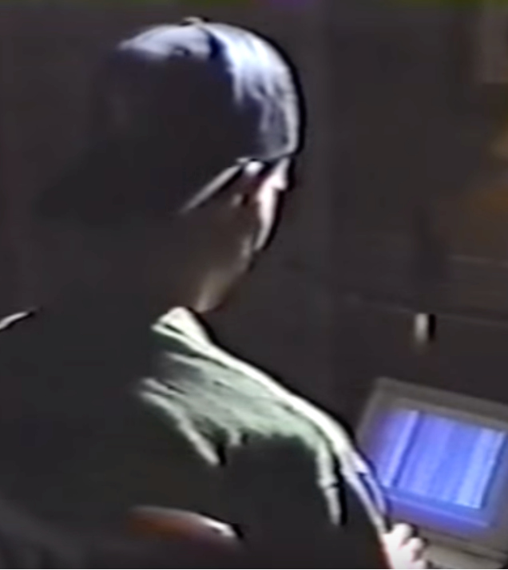
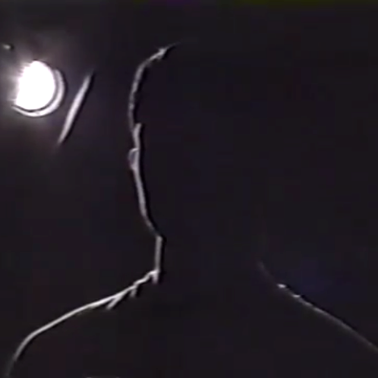

# 🧢 "Quentin" Overview

## **Earliest: "Quentin" on **_**Dateline NBC**_** and in **_**Phrack**_

* [**1992** _Dateline NBC_ segment](https://www.youtube.com/watch?v=N0QflNaPi7A\&t=77s)--"Quentin" is interviewed, with other hackers. [YouTube video](https://www.youtube.com/watch?v=N0QflNaPi7A),[ alternate](https://www.youtube.com/watch?v=5zjBrFSn3DE)

> _"Quentin told us he's...browsed through secret government files on UFOs, and gone snooping in our nation's military computers."_ - Narrator (2:15) &#x20;

* **1993** [Project Green Cheese / Project ALF-1](http://phrack.org/issues/42/13.html#article) published in _Phrack Magazine_, Issue 42, File 13. (Use _`CTRL+F`_ to find _"_`Text File`_"_ for the relevant part.)  \
  The [e-zine](https://en.wikipedia.org/wiki/Online\_magazine) prints UFO-related search terms and IP addresses of US secret networks, information supplied by "Quentin" and possibly two or more accomplices. &#x20;
* [Here's a mailing list](http://cd.textfiles.com/secretsubjects/UNDERGRD/VOL\_5/CUD513D.TXT) that predates the _Phrack_ article. ([Archived commentary](https://web.archive.org/web/20010303221709/http://paul.rutgers.edu/\~mcgrew/ufo/hackers)) &#x20;
* [**1994** Columns in _UFO Magazine_ by T. Scott Crain](1994-ufo-magazines.md), who wrote letters to NBC.
* **2019** [article about the NBC segment by Nick Redfern](https://web.archive.org/web/20221130210136/https://mysteriousuniverse.org/2019/11/ufos-computer-hacking-the-media-just-maybe-dead-aliens/), who attributes the quote:&#x20;

> _"The hacker is aware of the interest his apparent UFO data has provoked, but does not wish to respond."_ - the late Susan Adams (Dateline NBC producer)


**2019** Report by Giuliano Marinkovic tracking Quentin's text file.


Quentin's true identity remains unknown.

