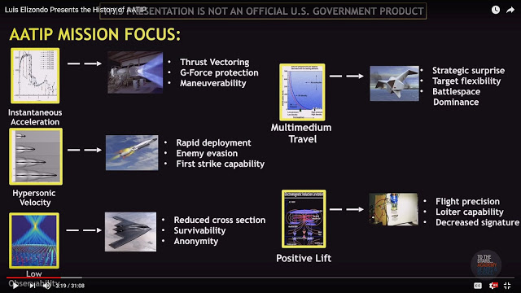

# 🛸 Beta: UFO Technology

## The 5 Observables

* Instantaneous Acceleration
* Hypersonic Velocity
* Low Observability
* Multimedium Travel
* Positive Lift

### [37 **Defense Intelligence Reference Documents (DIRDs)**](https://www.theblackvault.com/documentarchive/the-advanced-aerospace-weapon-system-applications-program-aawsap-documentation/)

(Toward the bottom of the linked page.)

## Additional Research

[Otis Carr, Ralph Ring and OTC-X1](https://www.youtube.com/watch?v=AXFXBg4jQ9Y) (1955) [Wiring](https://www.youtube.com/watch?v=trgY5HoC9QA)\
[Guidelines to Antigravity](http://u2.lege.net/culture.zapto.org\_82\_20080124/antigravidity/Robert%20L.Forward%20-%20Guidelines%20to%20Antigravity.pdf) by [Dr. Robert L. Forward](https://en.wikipedia.org/wiki/Robert\_L.\_Forward#Non-fiction) (1962)\
[Superconductors and Gravitational Drag](https://github.com/richgel999/uap\_resources/blob/main/Superconductors\_and\_Gravitational\_Drag\_PhysRevLett.16.1092.pdf) by [Bryce S. DeWitt](https://medium.com/@richgel99/superconductors-and-gravitational-drag-by-american-theoretical-physicist-bryce-s-dewitt-e203d7d13eed) (1966)\
[UFOs and Related Subjects: An Annotated Bibliography](https://apps.dtic.mil/sti/tr/pdf/AD0688332.pdf) by Lynn E. Catoe (1969)\
&#x20;    Many references to earlier works\
&#x20;    Page 349 of the PDF is labeled "Gravity and Anti-gravity"\
[How to Build a Flying Saucer](https://archive.org/details/how-to-build-a-flying-saucer-tbpawlicki) by T. B. Pawlicki (1981)\
[Negative Matter Propulsion](https://ayuba.fr/pdf/forward1990.pdf) by Dr. Robert L. Forward (1990)\
[**THE ANTIGRAVITY "UNDERGROUND"**](http://amasci.com/freenrg/antigrav.html) by Bill Beaty (1990s-current)\
&#x20;    Contains files from [KeelyNet](https://web.archive.org/web/20191019002820/http://www.keelynet.com/gravity.htm) (1996-1998) and others\
[UFOs and Anti-Gravity: Piece for a Jig-Saw](http://www.exopoliticshongkong.com/uploads/UFOs-AntiGravity-Piece-for-a-Jig-Saw-1997\_L\_G\_Cramp.pdf) by Leonard G. Cramp (1997)\
[Temple Of The Screaming Electron page "Gravity / Anty-gravity"](https://totseans.com/totse/en/fringe/gravity\_anti\_gravity/index.html) (1997-2006)\
[**Physics of UFO Gravity Manipulation**](http://www.zamandayolculuk.com/html-2/ufogravity.htm) - by Paul E Potter (1998)\
&#x20;    Based on the experience of Betty Andreasson (1967)\
[**StarDrive Engineering**](http://u2.lege.net/cetinbal/Stardrive2.htm) by [Mark R. Tomion](https://www.worldcat.org/title/stardrive-engineering/oclc/54356932) (2001)\
&#x20;    **Full PDF:** [Hi-Res Color and **Black & White w/ OCR**](https://archive.org/details/stardrive\_engineering) **<- please mirror (**[**Mega**](https://mega.nz/folder/wCklVSzC#BVfaU87k4f8wzJA79aJuJQ)**)**\
&#x20;    [Archived Site](https://web.archive.org/web/20071013103015/https://www.stardrivedevice.com/)\
&#x20;    [Book Excerpt](http://www.rexresearch.com/tomion/tomion.htm)\
&#x20;    [Patent](https://patents.google.com/patent/US6404089/pt-PT)\
[The UFO Technology Hackers Manual](https://ebin.pub/the-ufo-technology-hackers-manual.html) by Michael McDonnough (2006)\
[Frontiers of Propulsion Science](https://www.amazon.com/dp/1563479567) by M. Mills and Dr. Eric W. Davis (2009)\
The late Amy Eskridge presentetion at HAL5: [Abstract](http://hal5.org/program-2018-12.shtml), [Slides](http://hal5.org/PDF/HAL5-Dec2018-Talk-AntiGravity.pdf), [Video](https://youtu.be/FmhFKiq6FG8?t=166) (2018)\
[A Simplified Guide To Rocket Science and Beyond](https://www.techrxiv.org/doi/full/10.36227/techrxiv.22338391.v1) section VII (2023)

## Transparency Frameworks & Models

Mandatory Declassification Review\
Freedom Of Information Act (FOIA)\
&#x20;   _Problem: Private Corporations are Exempt_\
Technology Transfer Programs\
Free Libre Open Source Software\
[Creative Commons](https://creativecommons.org) and [Copyleft](https://en.wikipedia.org/wiki/Copyleft)

## Illuminated World

[Gravity Control Propulsion Research](https://en.wikipedia.org/wiki/United\_States\_gravity\_control\_propulsion\_research) on Wikipedia\
[MagnetoHydroDynamic Drive](https://en.wikipedia.org/wiki/Magnetohydrodynamic\_drive) on Wikipedia
